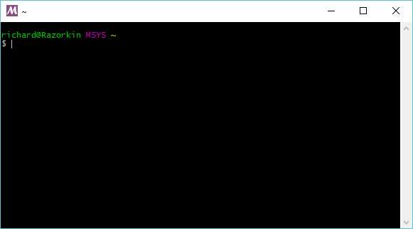
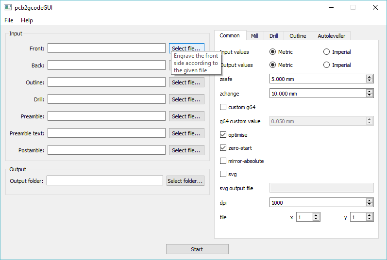

# Building PCB2GCode

## Setting up MSYS2

In order to build PCB2GCode under windows we need to use MSYS2

You can download the windows installer from one of the below links, for this doc I'll be using the x64 version under Windows 10

  * <https://msys2.github.io/>
  * <http://sourceforge.net/projects/msys2/>

After running the windows installer, open a MSYS2 prompt and run the following commands



```bash
pacman -Sy
pacman --needed -S bash pacman pacman-mirrors msys2-runtime
```

  * Wait for the install to finish in the shell
  * Close then re-open the MSYS2 shell
  * Run the following and wait for the install to finish, these are depends needed for pcb2gcode

```bash
pacman -Su
pacman --needed -S base-devel git mingw-w64-x86_64-gcc mingw-w64-x86_64-boost mingw-w64-x86_64-gtkmm mingw-w64-x86_64-imagemagick
```

## Compiling Sources

### Gerbv Setup

The next step is to setup Gerbv, we need to use version 2.6.0, since it's reported that 2.6.1 has issues

  * First **close** the **MSYS2** shell prompt
  * Instead open a **MinGW-w64 Win64 Shell** instead
  * This part is important as the paths are set slightly differently


This next part will download / compile and install gerbv under MSYS2

```bash
wget downloads.sourceforge.net/gerbv/gerbv-2.6.0.tar.gz
tar -xzf gerbv-2.6.0.tar.gz
cd gerbv-2.6.0/    
./configure --prefix=/mingw64 --disable-update-desktop-database
make
make install
```

### PCB2GCode Setup

The next step is to build / compile PCB2GCode, this also needs to be done within a **MinGW-w64 Win64 Shell**

```bash
cd ..
git clone https://github.com/pcb2gcode/pcb2gcode.git
cd pcb2gcode/
autoreconf -i
./configure --prefix=/mingw64
make LDFLAGS='-s'
```

## Installation

PCB2Gcode should now be located under C:\msys64\home\ric\pcb2gcode\.libs <br>
We also need some dll's, use the below script to copy everything needed into one directory

In order to gather all the files together in one place for Windows we can use the below script
to copy everything into one directory

**pcb2gcode_pkg.sh**
```bash
#!/bin/bash

mkdir -p pcb2gcode_build

cp pcb2gcode/.libs/pcb2gcode.exe ./pcb2gcode_build/
cp /mingw64/bin/libatk-1.0-0.dll ./pcb2gcode_build/
cp /mingw64/bin/libboost_program_options-mt.dll ./pcb2gcode_build/
cp /mingw64/bin/libbz2-1.dll ./pcb2gcode_build/
cp /mingw64/bin/libcairo-2.dll ./pcb2gcode_build/
cp /mingw64/bin/libcairomm-1.0-1.dll ./pcb2gcode_build/
cp /mingw64/bin/libexpat-1.dll ./pcb2gcode_build/
cp /mingw64/bin/libffi-6.dll ./pcb2gcode_build/
cp /mingw64/bin/libfontconfig-1.dll ./pcb2gcode_build/
cp /mingw64/bin/libfreetype-6.dll ./pcb2gcode_build/

# For the i686 binary
#cp /mingw64/bin/libgcc_s_dw2-1.dll  ./pcb2gcode_build/

# For the x86_64 binary
cp /mingw64/bin/libgcc_s_seh-1.dll  ./pcb2gcode_build/

cp /mingw64/bin/libgdkmm-2.4-1.dll ./pcb2gcode_build/
cp /mingw64/bin/libgdk_pixbuf-2.0-0.dll ./pcb2gcode_build/
cp /mingw64/bin/libgdk-win32-2.0-0.dll ./pcb2gcode_build/
cp /mingw64/bin/libgerbv-1.dll ./pcb2gcode_build/
cp /mingw64/bin/libgio-2.0-0.dll ./pcb2gcode_build/
cp /mingw64/bin/libglib-2.0-0.dll ./pcb2gcode_build/
cp /mingw64/bin/libglibmm-2.4-1.dll ./pcb2gcode_build/
cp /mingw64/bin/libgmodule-2.0-0.dll ./pcb2gcode_build/
cp /mingw64/bin/libgobject-2.0-0.dll ./pcb2gcode_build/
cp /mingw64/bin/libgtk-win32-2.0-0.dll ./pcb2gcode_build/
cp /mingw64/bin/libharfbuzz-0.dll ./pcb2gcode_build/
cp /mingw64/bin/libiconv-2.dll ./pcb2gcode_build/
cp /mingw64/bin/libintl-8.dll ./pcb2gcode_build/
cp /mingw64/bin/libpango-1.0-0.dll ./pcb2gcode_build/
cp /mingw64/bin/libpangocairo-1.0-0.dll ./pcb2gcode_build/
cp /mingw64/bin/libpangoft2-1.0-0.dll ./pcb2gcode_build/
cp /mingw64/bin/libpangomm-1.4-1.dll ./pcb2gcode_build/
cp /mingw64/bin/libpangowin32-1.0-0.dll ./pcb2gcode_build/
cp /mingw64/bin/libpixman-1-0.dll ./pcb2gcode_build/
cp /mingw64/bin/libpng16-16.dll ./pcb2gcode_build/
cp /mingw64/bin/libsigc-2.0-0.dll ./pcb2gcode_build/
cp /mingw64/bin/libstdc++-6.dll ./pcb2gcode_build/
cp /mingw64/bin/libwinpthread-1.dll ./pcb2gcode_build/
cp /mingw64/bin/zlib1.dll ./pcb2gcode_build/
```

## PCB2GCodeGUI

The GUI provides a nice front end to the CLI utility

First download the source
```
git clone https://github.com/pcb2gcode/pcb2gcodeGUI.git
```

  * Next install QT Libraries for Windows, including QT Creator <br>
  * Use QT Creator to build the .pro file into a windows executable
  * Place the generated exe into the same directory as PCB2GCode.exe


